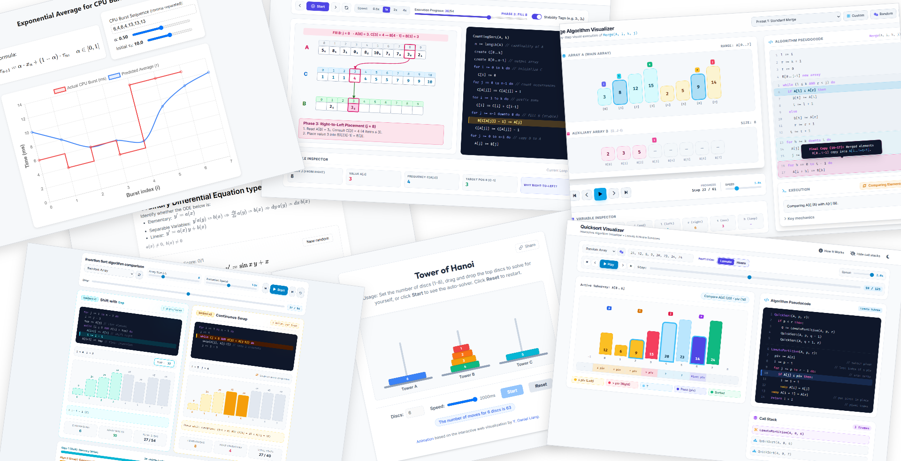

# Interactive University Exercises & Visualizations

A collection of self-contained interactive visualizations and exercises for Computer Science and Mathematics concepts that I'm using to learn those things in a more hands-on, easier to understand way.

> [!WARNING]
> The interactive demos in this repo are heavily vibecoded as a way for me to quickly have a live visualization of concepts as I'm studying them for university, especially if no suitable alternative already exists online or I need something more specific.
Although I verify the correctness and try to keep the code reasonably clean and simple, these projects are not intended as examples of best practices or production-quality implementations. I also don't guarantee that they're free of mistakes.
Still, if you spot an issue, find an error, or have an idea for an improvement, feel free to open an Issue or submit a Pull Request. I'll do my best to review and respond whenever I can!
